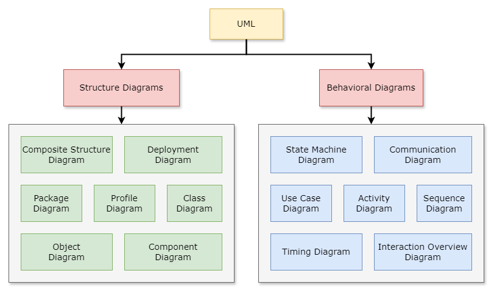

# Unified Modeling Language (UML)

The Unified Modeling Language (UML) is a standardized visual modeling language used in software engineering for
designing, documenting, and visualizing software systems. UML provides a set of graphical notations for specifying,
visualizing, constructing, and documenting the artifacts of software systems. It is a common language for software
architects, designers, developers, and stakeholders to communicate system designs in a clear and concise manner.

Imagine if you're building a house. Before you start hammering nails, you create a plan showing how rooms connect, where
windows go, and so on. UML does the same thing but for software. It helps developers visualize, design, and communicate
how different parts of a software system work together. So, instead of drawing walls and doors, they draw boxes and
arrows to show things like classes, functions, and how they interact.
---

## Type of UML

---

## Structure diagrams

### Class diagram

A class diagram illustrates the structure of a system by showing the classes in the
system, their attributes, methods, and the relationships between them. In simple terms, it's like a blueprint of the
objects and their interactions in a software system.

_Image Source: javatpoint.com_

Tutorial:

- https://www.javatpoint.com/uml-class-diagram
- https://www.visual-paradigm.com/guide/uml-unified-modeling-language/uml-class-diagram-tutorial/

### Object diagram

Object diagrams are derived from class diagrams so object diagrams are dependent upon class diagrams.  
An object diagram shows a snapshot of the objects in a system at a particular point in
time, along with their relationships and attributes. It provides a detailed view of instances of classes and how they
interact with each other.

  

_Image Source: edrawmax.com_

Tutorial:

- https://www.visual-paradigm.com/guide/uml-unified-modeling-language/what-is-object-diagram/
- https://www.lucidchart.com/pages/uml-object-diagram

### Component Diagram

Component diagram shows the components of a system and their relationships. It's used to model the high-level
architecture of a software system, illustrating the organization and dependencies among various components.  
In a Component diagram, components represent modular parts of a system, which can be software modules, classes, files,
libraries, executables, etc. These components encapsulate functionality and are often reusable and replaceable.
Components can have interfaces that define how they interact with other components.

_Image Source: visual-paradigm.com_

Tutorial:

- https://creately.com/blog/software-teams/component-diagram-tutorial
- https://online.visual-paradigm.com/diagrams/tutorials/component-diagram-tutorial

### Deployment diagram

A Deployment diagram visualizes the physical deployment of software components within a system's infrastructure. It
illustrates how software artifacts, such as components or modules, are distributed across hardware nodes, like servers
or devices, in a networked environment.

_Image Source: visual-paradigm.com_

Tutorial:

- https://online.visual-paradigm.com/diagrams/tutorials/deployment-diagram-tutorial
- https://creately.com/guides/deployment-diagram-tutorial

### Composite Structure Diagram

A Composite Structure Diagram illustrates the internal structure of a class or a component. It shows how the parts or
components within a larger structure collaborate to fulfill the behavior of the whole.

_Image Source: lucidchart.com_

Tutorial:

- https://www.lucidchart.com/pages/uml-composite-structure-diagram
- https://www.edrawmax.com/article/composite-structure-diagram-explained.html

### Package Diagram

A Package Diagram provides a graphical representation of the organization and dependencies among packages in a system.
Packages are used to group related elements, such as classes, interfaces, components, or other packages, to manage the
complexity of a system and facilitate modular design and development.

_Image Source: edrawmax.com_

Tutorial:

- https://www.lucidchart.com/pages/uml-package-diagram
- https://www.geeksforgeeks.org/package-diagram-introduction-elements-use-cases-and-benefits/

### Profile Diagram

A Profile Diagram is a specialized diagram used to define and visualize custom extensions or profiles to the standard
UML language. It allows users to create custom stereotypes, tagged values, constraints, and other extensions tailored to
specific modeling needs or domain-specific requirements.

_Image Source: visual-paradigm.com_

Tutorial:

- https://www.visual-paradigm.com/guide/uml-unified-modeling-language/what-is-profile-diagram

--- 

## Behavior diagrams

### Sequence Diagram

A UML sequence diagram is a type of interaction diagram that illustrates how objects in a system interact with each
other in a particular scenario or sequence of events. It depicts the flow of messages, along with the lifelines of
participating objects or actors, arranged in a chronological order from top to bottom. Sequence diagrams are useful for
visualizing the dynamic behavior of a system, understanding the sequence of operations, identifying potential
bottlenecks, and designing or documenting complex systems and processes.

_Image Source: visual-paradigm.com_

Tutorial:

- https://online.visual-paradigm.com/diagrams/tutorials/sequence-diagram-tutorial
- https://www.javatpoint.com/uml-sequence-diagram

### Use Case Diagram

A Use Case diagram is a graphical representation of the interactions between users (actors) and a system, showcasing the
various ways users interact with the system to achieve specific goals. Actors are external entities such as users, other
systems, or hardware devices that interact with the system. Use cases represent the functionalities or tasks the system
provides to its users. These diagrams typically consist of actors represented by stick figures and use cases represented
by ovals or rectangles, connected by lines to illustrate the relationships and interactions between them.

_Image Source: lucidchart.com_

Tutorial:

- https://creately.com/guides/use-case-diagram-tutorial
- https://online.visual-paradigm.com/diagrams/tutorials/use-case-diagram-tutorial

### Activity Diagram

An Activity diagram illustrates the flow of activities or actions within a system or business process. It provides a
visual representation of the sequential and concurrent activities performed by the system, actors, or objects to
accomplish a specific goal or task. Activity diagram is useful for modeling the dynamic aspects of a system, such as
business workflows, use case scenarios, and software behavior, aiding in requirements analysis, system design, and
process optimization.

_Image Source: lucidchart.com_

Tutorial:

- https://www.lucidchart.com/pages/uml-activity-diagram
- https://creately.com/guides/activity-diagram-tutorial/

