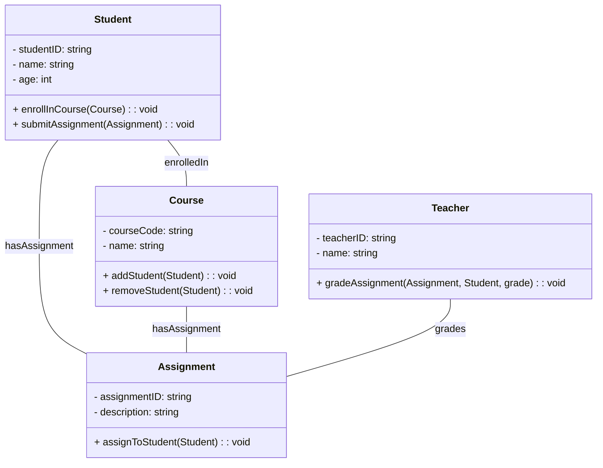

# Unified Modeling Language (UML)

The Unified Modeling Language (UML) is a standardized visual modeling language used in software engineering for
designing, documenting, and visualizing software systems. UML provides a set of graphical notations for specifying,
visualizing, constructing, and documenting the artifacts of software systems. It is a common language for software
architects, designers, developers, and stakeholders to communicate system designs in a clear and concise manner.

Imagine if you're building a house. Before you start hammering nails, you create a plan showing how rooms connect, where
windows go, and so on. UML does the same thing but for software. It helps developers visualize, design, and communicate
how different parts of a software system work together. So, instead of drawing walls and doors, they draw boxes and
arrows to show things like classes, functions, and how they interact.
---

## Type of UML

---

## Structure diagrams

### Class diagram

A class diagram illustrates the structure of a system by showing the classes in the
system, their attributes, methods, and the relationships between them. In simple terms, it's like a blueprint of the
objects and their interactions in a software system.

### Object diagram
An object diagram shows a snapshot of the objects in a system at a particular point in
time, along with their relationships and attributes. It provides a detailed view of instances of classes and how they
interact with each other.
